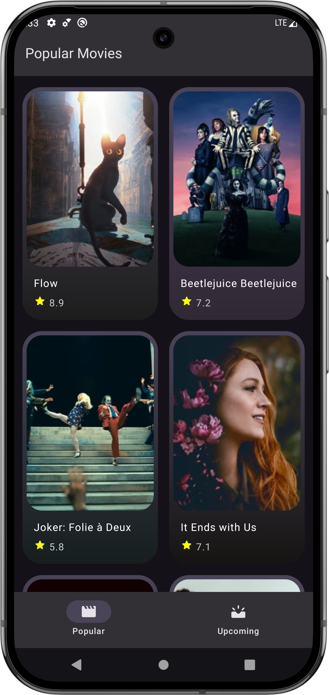

# Movies App

This app displays a list of popular and upcoming movies with a simple and intuitive interface. The
bottom navigation bar allows users to switch between these two categories. Tapping on any movie
takes the user to a detailed page with more information about the selected movie.

Additionally, the app follows an offline-first approach, meaning once the data is fetched from the
internet, users can access the app even without an internet connection.

## Key Features:

- Bottom navigation with two sections: Popular Movies and Upcoming Movies
- Movie detail pages
- Offline-first functionality: Access data without an internet connection after the initial sync

## Libraries Used:

- Hilt: For dependency injection
- Room: For local database management
- Coil: For loading images
- Retrofit: For networking and API requests

  
  

